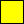
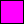
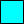

# The New and Improved _beatblock guide_
More info from base editor guide.

## Table of Contents

 Will Do later

## Getting Started

### Importing Songs

### Issues with Importing Songs

### Placing Notes & Events

### Note Types

### VFX Event Types

### Other Event Types (and advanced)

### Hotkeys

## Var List

### Bools
caseSensitive = true

#### Standard Bools
| Variable Name             | Default | Description                                                            |
| ------------------------- | ------- | ---------------------------------------------------------------------- |
| vfx.hwaves.flip           | false   | Should the amplitude of hwaves flip every frame? (hwaves is easable)   |
| vfx.notesFollowPlayer     | true    | Should notes move with the player when p.x or p.y is changed           |
| vfx.drawCombo             | true    | Should combo be displayed?                                             |
| vfx.drawAccuracy          | true    | Should accuracy be displayed in expanded hud?                          |
| vfx.drawSongTitle         | true    | Should song title be displayed in expanded hud?                        |
| vfx.drawUI                | true    | Should UI be displayed? (has priority over draw vars)                  |
| vfx.ignoreNoiseCorrection | false   | Should the alternate noise calculation methode be used?                |
| exitingLevel              | false   | Should the level end on pause-resume or beat 0 if placed in load beat? |
| vfx.calibration           | false   | Should the level use calibration system?                               |
| paused                    | false   | Should the level be paused?                                            |
| holdEntityDraw            | true    | Should do something with holds?                                        |

#### Editor Only Bools (broken stuff)
| Variable Name             | Default | Description                                                                                                       |
| ------------------------- | ------- | ----------------------------------------------------------------------------------------------------------------- |
| choosingVariant           | true    | Should do something?                                                                                              |
| errorDialogue             | false   | Should the error dialogue exist? (does make *an* error dialogue in standard play, just not the one it's meant to) |
| levelPropertiesDialogue   | false   | Should the level properties dialogue exist?                                                                       |
| allowDevOnly              | false   | Should dev only stuff be allowed?                                                                                 |
| overlappingEventsDialogue | false   | Should the overlapping events dialogue be shown?                                                                  |
| resetwindows              | false   | Should the windows be reset?                                                                                      |
| multieditdeltamode        | false   | Should delta mode be enabled in multiselect?                                                                      |
| altSliderHovered          | false   | Should the alt slider be hovered over?                                                                            |
| altSliderHeld             | false   | Should the alt slider be held?                                                                                    |
| startClickFromSlider      | false   | Should do something?                                                                                              |
| And more variables        | yes     | Should there be more vars?                                                                                        |

THE INCONSISTENCIES ARE **NOT MY FAULT, blame the devs.** (jk they are amazing people, please don't yell at them)

### Eases

#### VFX Easables
| Variable Name           | Default | Description                                                                 |
| ----------------------- | ------- | --------------------------------------------------------------------------- |
| scrollSpeed             | 1       | Multiplies the scroll speed set in the level properties.                    |
| extraHoldLeniency       | 0       | Adds to the leniency timer for holds. (sadly can't be negative)             |
| noteRadius              | 9       | How big the hit radius for notes are. (not the same as scale)               |
| objectRotation          | 0       | Rotates all of the notes by a certain rotation.                             |
| vfx.noteXScale          | 1       | Scales notes along X axis.                                                  |
| vfx.noteYscale          | 1       | Scales notes along Y axis.                                                  |
| vfx.noteXSkew           | 0       | Skews notes along X axis.                                                   |
| vfx.noteYSkew           | 0       | Skews notes along Y axis.                                                   |
| vfx.extraTapWidth       | 2       | Default line thickness for Extra Taps.                                      |
| vfx.extraTapWidthPulse  | 3       | Line thickness for Extra Taps on pulses.                                    |
| vfx.tapPulsePeriod      | 1       | How often taps should pulse.                                                |
| vfx.tapPulseStrength    | 1.5     | How much taps should grow by on pulses.                                     |
| vfx.tapWidthPulse       | 3       | Line thickness for taps on pulses.                                          |
| vfx.angleTwist.offset   | 0       | How much angles should be offset by at the specified distance.              |
| vfx.angleTwist.distance | 8       | How far away angles should be offset from.                                  |
| vfx.hglitch.strength    | 0       | How many pixels in either direction hglitch can shift.                      |
| vfx.hglitch.resolution  | 3       | How tall in pixels hglitch "chunks" should be.                              |
| vfx.hwaves.strength     | 0       | Controls the amplitude of the screen waves.                                 |
| vfx.hwaves.offset       | 0       | How offset the waves should be.                                             |
| vfx.hwaves.offsetDelta  | 0       | How much the offset should be changed ever frame.                           |
| vfx.pixelate            | 1       | How pixelated the screen should be.                                         |
| vfx.holdSegmentLimit    | 0       | How many segments every hold should have. (0 to disable)                    |
| vfx.bgNoise             | 0       | Allows easing of the Noise event's "chance" variable.                       |
| vfx.canvPos.x           | 300     | What X position the main game canvas should be drawn at.                    |
| vfx.canvPos.y           | 180     | What Y position the main game canvas should be drawn at.                    |
| vfx.canvPos.r           | 0       | How many degrees to rotate the main canvas.                                 |
| vfx.canvPos.sx          | 1       | Scales the main game canvas hoizontally.                                    |
| vfx.canvPos.sy          | 1       | Scales the main game canvas vertically.                                     |
| vfx.canvPos.ox          | 300     | What X offset the main game canvas should be drawn at.                      |
| vfx.canvPos.oy          | 180     | What Y offset the main game canvas should be drawn at.                      |
| vfx.canvPos.kx          | 0       | Skews the main game canvas along the X axis.                                |
| vfx.canvPos.ky          | 0       | Skews the main game canvas along the Y axis.                                |
| vfx.comboX              | 0       | What X Position the combo counter should be drawn at.                       |
| vfx.comboY              | 0       | What Y Position the combo counter should be drawn at.                       |
| vfx.accuracyX           | 0       | What X position the accuracy should be drawn at.                            |
| vfx.accuracyY           | 0       | What Y position the accuracy should be drawn at.                            |
| vfx.songName.X          | 0       | You get it.                                                                 |
| vfx.songName.Y          | 0       | You get it.                                                                 |
| vfx.difficultyX         | 0       | You get it.                                                                 |
| vfx.difficultyY         | 0       | You get it.                                                                 |
| vfx.uiColor             | 1       | Change color channel UI uses. int(0-7)                                      |
| vfx.glitchUIElements    | 0       | Glitches UI Elements: 0-None,1-Combo,2-Combo+Acc,3-Combo+Acc+SongName,4-All |
| vfx.hueShift            | 0       | Shift the hue of the level by given amount.                                 |
| vfx.flashStrength       | 0       | How much the screen flash is visible at given time.                         |
| vfx.flashColor.r        | 0       | Adjusts red value of screen flash.                                          |
| vfx.flashColor.g        | 0       | Adjusts green value of screen flash.                                        |
| vfx.flashColor.b        | 0       | Adjusts blue value of screen flash.                                         |

#### Player Easables
| Variable Name       | Default | Description                                                            |
| ------------------- | ------- | ---------------------------------------------------------------------- |
| p.x                 | 300     | Cranky's X pos.                                                        |
| p-----------------y | 1-0     | C--------------------------------------------------------------------. |
| p.paddleDistance    | 31      | The distance between Cranky and the Paddle.                            |
| p.lookYOffset       | 0       | Changes where Cranky's eyes are drawn on the Y axis.                   |
| p.lookRadius        | 6       | The radius where Cranky's eyes will follow your cursor.                |
| p.outlineColor      | 1       | Changes Cranky's outline color channel int(0-7)                        |
| p.fillColor         | 0       | Changes Cranky's fill color channel int(0-7)                           |
| p.faceColor         | -1      | Changes Cranky's face color channel. -1 shows OG colors. (-1+int(0-7)) |
| p.bodyRadius        | 20      | The radius that Cranky's body is drawn at.                             |
| p.drawScale         | 1       | The scale that Cranky is drawn at.                                     |
| p.layer             | 0       | The layer that Cranky is drawn on.                                     |
| p.extend            | 0       | Extend Cranky's body and paddle.                                       |
| p.ouchTime          | 15      | How long the pulse from missing a note lasts.                          |
| p.lineWidth         | 2       | How thick Cranky's outlines are.                                       |
| p.maxBodyPulse      | 0.2     | How stong the pulse from missing a note is.                            |
| p.feedbackAmplitude | 2.5     | How strong the feedback is for hitting notes with the paddle.          |
| p.feedbackDuration  | 4       | How long the feedback for hitting with the paddle lasts.               |
|                     |         |                                                                        |

 There are text eases, more info **will** be in wiki

## Deco

### Color Channels (and another bypass mod)
| ColorChannel | DecoColor | -                 |
| ------------ | :-------: | ----------------- |
| 0            |  #FFFFFF  | ⬜                |
| 1            |  #000000  | ⬛                |
| 2            |  #FF0000  | 🟥               |
| 3            |  #0000FF  | 🟦               |
| 4            |  #00FF00  | 🟩               |
| 5            |  #FFFF00  |   |
| 6            |  #FF00FF  |  |
| 7            |  #00FFFF  |     |

If you wish to bypass this color limit, I would recommend using the ["Colorful!"](https://github.com/ImPurplez/Colorful/releases/tag/v1) mod.
### Deco Properties

### Still Decos

### Animated Decos

## Rhythms 101

### Basic Rhythms

### Weird/advanced rhythms
