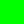
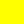
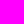

# The New and Improved _beatblock guide_
<!-- title: The New and Improved _beatblock guide_ -->
More info from base editor guide.

## Table of Contents

- [Getting Started](#getting-started)
  - [Importing Songs](#importing-songs)
  - [GETTING THE OFFSET](#getting-the-offset)
  - [Issues with Importing Songs](#issues-with-importing-songs)
  - [Placing Notes \& Events](#placing-notes--events)
  - [Note Types](#note-types)
  - [VFX Event Types](#vfx-event-types)
  - [Other Event Types (and advanced)](#other-event-types-and-advanced)
  - [Hotkeys](#hotkeys)
- [Var List](#var-list)
  - [Bools](#bools)
    - [Standard Bools](#standard-bools)
    - [Editor Only Bools (broken stuff and goofy)](#editor-only-bools-broken-stuff-and-goofy)
  - [Eases](#eases)
    - [VFX Easables](#vfx-easables)
    - [Player Easables](#player-easables)
- [Deco](#deco)
  - [Color Channels (and another bypass mod)](#color-channels-and-another-bypass-mod)
  - [Deco Properties](#deco-properties)
  - [Still Decos](#still-decos)
  - [Animated Decos](#animated-decos)
- [Rhythms 101](#rhythms-101)
  - [Basic Rhythms](#basic-rhythms)
  - [Weird/advanced rhythms](#weirdadvanced-rhythms)

## Getting Started

### Importing Songs

1. Download song file in the format of OGG Vorbis(.ogg) (for YT vids use [cobalt](https://cobalt.tools))
2. Open two instances(or tabs) of file explorer.
3. Open one to where you downloaded the file to and the other instance(or tab) to the level folder
4. Move/copy the .ogg file to the level folder.
5. In the level editor place a play song event(in the gameplay section)
6. In the 'file' section, put the file name(with .ogg).
7. Make sure to put the BPM and offset.

### GETTING THE OFFSET

#### if you don't do this I will personally find and attack you (that's a joke)

1. Download [Audacity](https://www.audacityteam.org/download/windows/)
2. Open Audacity
3. Drag and drop the OGG file from file explorer to Audacity.
4. Set the time view to seconds+milliseconds in Audacity.
5. Zoom in to the start of the song and click where the wavelengths start to spike. (most songs will be under 1 second but there are some exceptions)
6. Enter the value shown in the time display into the offset section of the play song trigger.

### Issues with Importing Songs

#### Make sure that you have an OGG vorbis file

- Many converters and downloaders will give you a non OGG file just with the file extension changed.

- Downloading YT vids from [cobalt](https://cobalt.tools) is known to work
- Converting with Audacity also works
    1. Import file to Audacity by dragging and dropping
    2. Go to file>export audio
    3. Select Export to computer
    4. Change format to `Ogg Vorbis File` from `WAV (Microsoft)`
    5. Re-import the song.

#### Make sure you have file name extensions enabled

- Windows
    1. Press view on the top ribbon in file explorer.
    2. Hover over show.
    3. Turn on file name extensions.

- Linux
    1. Most Linux file managers already have this setup, and there are so many there's no point in listing instructions for all of theme here.

- MacOS
    1. Open finder
    2. In the top bar, go to Finder > Settings.
    3. From there go to advanced and turn "show all filename extensions" on.
- Make sure you actually changed BPM and added your offset.

### Placing Notes & Events

### Note Types

| Note Name | Note Desc                                                                                                 | Image                                |
| --------- | --------------------------------------------------------------------------------------------------------- | ------------------------------------ |
| Block     | We beat these, they're the simplest note. Hit them with your paddle.                                      |    |
| Hold      | Also hit these with paddles but you must keep your paddle on it for the duration of the hold.*            |      |
| Inverse   | Negative Blocks, they come from the opposite direction. You must hit it with the backside of your paddle. |    |
| Mine      | The spikey block, If you block this with your paddle, You'll get hurt. Point your paddle away from it.    |          |
| Mine Hold | The hold varient of a mine. It's like a mine but longer and can hurt you consecutively. don't touch.      |  |
| Side      | You can not hit these straight on, Strike them on their side to destory it. (Purpz's worst enemy)         |          |
| Trace     | These are not naturally available (Advanced). It creates a dithered line between 2 points.**              |        |
| ExtraTap  | its a tap, but not constrained to a specific note. so uh go wild (please don't i can only press z so fa-) |  |

\* If you increased extraHoldLeniency (see VFX easables), Then you will be able to move your paddle without breaking the hold. 

** talk to flecha da foxy for more ~ _IPz

### VFX Event Types

| Event Name | Event Desc                                                                                                    | Image                            |
| ---------- | ------------------------------------------------------------------------------------------------------------- | -------------------------------- |
| Ease       | The world's most powerful event in the game IMO and everything in Eases can be altered with this event.       |     |
| Decoration | Everything artwise found in charts is the responsiblity of the Deco Event. For more, Go to the Deco Section.  |     |
| H.O.M.     | Hall of Mirrors, You know that effect when you are in the skybox outside the map? that? it's that.            |    |
| Noise      | It creates a Noise/Static effect, Best used with HOM to make a trailing effect with notes. Will kill bitrate  |   |
| Bookmark   | Much like an actual bookmark, creates a pointer that you can find easily with Alt in the editor.              |    |
| Set Bool   | Sets a Boolean to either True or False. Essentially a weaker version of Ease.                                 |   |
| Outline    | it creates an outline around Notes, Cranky, and text.                                                         |  |
| Play Sound | Plays a sound, like any sound. as long it's in the level file or in the base game... _this aint a visual..._  |  |
| Particles  | Toggles the particles, that is all i know. If you want to help anywhere like this, please make a pull request |  |

### Other Event Types (and advanced)

### Hotkeys

## Var List

### Bools

these are "caseSensitive"

#### Standard Bools

| Variable Name             | Default | Description                                                            |
|---------------------------|---------|------------------------------------------------------------------------|
| vfx.hwaves.flip           | false   | Should the amplitude of hwaves flip every frame? (hwaves is easable)   |
| vfx.notesFollowPlayer     | true    | Should notes move with the player when p.x or p.y is changed           |
| vfx.drawCombo             | true    | Should combo be displayed?                                             |
| vfx.drawAccuracy          | true    | Should accuracy be displayed in expanded hud?                          |
| vfx.drawSongTitle         | true    | Should song title be displayed in expanded hud?                        |
| vfx.drawUI                | true    | Should UI be displayed? (has priority over draw vars)                  |
| vfx.ignoreNoiseCorrection | false   | Should the alternate noise calculation methode be used?                |
| exitingLevel              | false   | Should the level end on pause-resume or beat 0 if placed in load beat? |
| vfx.calibration           | false   | Should the level use calibration system?                               |
| paused                    | false   | Should the level be paused?                                            |
| holdEntityDraw            | true    | Should do something with holds?                                        |

#### Editor Only Bools (broken stuff and goofy)

| Variable Name             | Default | Description                                                                                                       |
|---------------------------|---------|-------------------------------------------------------------------------------------------------------------------|
| choosingVariant           | true    | Should do something?                                                                                              |
| errorDialogue             | false   | Should the error dialogue exist? (does make _an_ error dialogue in standard play, just not the one it's meant to) |
| levelPropertiesDialogue   | false   | Should the level properties dialogue exist?                                                                       |
| allowDevOnly              | false   | Should dev only stuff be allowed?                                                                                 |
| overlappingEventsDialogue | false   | Should the overlapping events dialogue be shown?                                                                  |
| resetwindows              | false   | Should the windows be reset?                                                                                      |
| multieditdeltamode        | false   | Should delta mode be enabled in multiselect?                                                                      |
| altSliderHovered          | false   | Should the alt slider be hovered over?                                                                            |
| altSliderHeld             | false   | Should the alt slider be held?                                                                                    |
| startClickFromSlider      | false   | Should do something?                                                                                              |
| And more variables        | yes     | Should there be more vars?                                                                                        |

`THE INCONSISTENCIES ARE`**`NOT MY FAULT`**`, blame the devs.`_`(jk they are amazing people, please don't yell at them)`_

### Eases

#### VFX Easables

| Variable Name           | Default | Description                                                                                                                   |
|-------------------------|---------|-------------------------------------------------------------------------------------------------------------------------------|
| scrollSpeed             | 1       | Multiplies the scroll speed set in the level properties.                                                                      |
| extraHoldLeniency       | 0       | Adds to the leniency timer for holds. (sadly can't be negative)                                                               |
| noteRadius              | 9       | How big the hit radius for notes are. (not the same as scale)                                                                 |
| objectRotation          | 0       | Rotates all of the notes by a certain rotation.                                                                               |
| vfx.noteXScale          | 1       | Scales notes along X axis.                                                                                                    |
| vfx.noteYscale          | 1       | Scales notes along Y axis.                                                                                                    |
| vfx.noteXSkew           | 0       | Skews notes along X axis.                                                                                                     |
| vfx.noteYSkew           | 0       | Skews notes along Y axis.                                                                                                     |
| vfx.extraTapWidth       | 2       | Default line thickness for Extra Taps.                                                                                        |
| vfx.extraTapWidthPulse  | 3       | Line thickness for Extra Taps on pulses.                                                                                      |
| vfx.tapPulsePeriod      | 1       | How often taps should pulse.                                                                                                  |
| vfx.tapPulseStrength    | 1.5     | How much taps should grow by on pulses.                                                                                       |
| vfx.tapWidthPulse       | 3       | Line thickness for taps on pulses.                                                                                            |
| vfx.angleTwist.offset   | 0       | How much angles should be offset by at the specified distance.                                                                |
| vfx.angleTwist.distance | 8       | How far away angles should be offset from.                                                                                    |
| vfx.hglitch.strength    | 0       | How many pixels in either direction hglitch can shift.                                                                        |
| vfx.hglitch.resolution  | 3       | How tall in pixels hglitch "chunks" should be.                                                                                |
| vfx.hwaves.strength     | 0       | Controls the amplitude of the screen waves.                                                                                   |
| vfx.hwaves.offset       | 0       | How offset the waves should be.                                                                                               |
| vfx.hwaves.offsetDelta  | 0       | How much the offset should be changed ever frame.                                                                             |
| vfx.pixelate            | 1       | How pixelated the screen should be.                                                                                           |
| vfx.holdSegmentLimit    | 0       | How many segments every hold should have. (0 to disable)                                                                      |
| vfx.bgNoise             | 0       | Allows easing of the Noise event's "chance" variable.                                                                         |
| vfx.canvPos.x           | 300     | What X position the main game canvas should be drawn at.                                                                      |
| vfx.canvPos.y           | 180     | What Y position the main game canvas should be drawn at.                                                                      |
| vfx.canvPos.r           | 0       | How many degrees to rotate the main canvas.                                                                                   |
| vfx.canvPos.sx          | 1       | Scales the main game canvas hoizontally.                                                                                      |
| vfx.canvPos.sy          | 1       | Scales the main game canvas vertically.                                                                                       |
| vfx.canvPos.ox          | 300     | What X offset the main game canvas should be drawn at.                                                                        |
| vfx.canvPos.oy          | 180     | What Y offset the main game canvas should be drawn at.                                                                        |
| vfx.canvPos.kx          | 0       | Skews the main game canvas along the X axis.                                                                                  |
| vfx.canvPos.ky          | 0       | Skews the main game canvas along the Y axis.                                                                                  |
| vfx.comboX              | 0       | What X Position the combo counter should be drawn at.                                                                         |
| vfx.comboY              | 0       | What Y Position the combo counter should be drawn at.                                                                         |
| vfx.accuracyX           | 0       | What X position the accuracy should be drawn at.                                                                              |
| vfx.accuracyY           | 0       | What Y position the accuracy should be drawn at.                                                                              |
| vfx.songName.X          | 0       | You get it.                                                                                                                   |
| vfx.songName.Y          | 0       | You get it.                                                                                                                   |
| vfx.difficultyX         | 0       | You get it.                                                                                                                   |
| vfx.difficultyY         | 0       | You get it.                                                                                                                   |
| vfx.uiColor             | 1       | Change color channel UI uses. int(0-7)                                                                                        |
| vfx.glitchUIElements    | 0       | Glitches UI Elements:   0 - None,   1 - Combo,   2 - Combo + Acc,   3 - Combo + Acc + SongName,   4 - All |
| vfx.hueShift            | 0       | Shift the hue of the level by given amount.                                                                                   |
| vfx.flashStrength       | 0       | How much the screen flash is visible at given time.                                                                           |
| vfx.flashColor.r        | 0       | Adjusts red value of screen flash.  Integers [0-255] only                                                                 |
| vfx.flashColor.g        | 0       | Adjusts green value of screen flash.  Integers [0-255] only                                                               |
| vfx.flashColor.b        | 0       | Adjusts blue value of screen flash.   do i even have to say it anymore?                                                   |

#### Player Easables

| Variable Name       | Default | Description                                                            |
|---------------------|---------|------------------------------------------------------------------------|
| p.x                 | 300     | Cranky's X pos.                                                        |
| p.y                 | 180     | Cranky's Y pos.                                                        |
| p.paddleDistance    | 31      | The distance between Cranky and the Paddle.                            |
| p.lookYOffset       | 0       | Changes where Cranky's eyes are drawn on the Y axis.                   |
| p.lookRadius        | 6       | The radius where Cranky's eyes will follow your cursor.                |
| p.outlineColor      | 1       | Changes Cranky's outline color channel int(0-7)                        |
| p.fillColor         | 0       | Changes Cranky's fill color channel int(0-7)                           |
| p.faceColor         | -1      | Changes Cranky's face color channel. -1 shows OG colors. (-1+int(0-7)) |
| p.bodyRadius        | 20      | The radius that Cranky's body is drawn at.                             |
| p.drawScale         | 1       | The scale that Cranky is drawn at.                                     |
| p.layer             | 0       | The layer that Cranky is drawn on.                                     |
| p.extend            | 0       | Extend Cranky's body and paddle.                                       |
| p.ouchTime          | 15      | How long the pulse from missing a note lasts.                          |
| p.lineWidth         | 2       | How thick Cranky's outlines are.                                       |
| p.bodyPulse         | 0       | The scale of Cranky's main body. Can be overrided by misses.           |
| p.maxBodyPulse      | 0.2     | How stong the pulse from missing a note is.                            |
| p.feedbackAmplitude | 2.5     | How strong the feedback is for hitting notes with the paddle.          |
| p.feedbackDuration  | 4       | How long the feedback for hitting with the paddle lasts.               |

 There are text eases, more info **will** be in wiki

## Deco

### Color Channels (and another bypass mod)

| ColorChannel | DecoColor |                                |
|--------------|:---------:|--------------------------------|
| 0            |  #FFFFFF  |    |
| 1            |  #000000  |    |
| 2            |  #FF0000  |      |
| 3            |  #0000FF  |    |
| 4            |  #00FF00  |    |
| 5            |  #FFFF00  |   |
| 6            |  #FF00FF  |  |
| 7            |  #00FFFF  |     |

If you wish to bypass this color limit, I would recommend using the ["Colorful!"](https://github.com/ImPurplez/Colorful/releases/tag/v1) mod.

### Deco Properties

### Still Decos

### Animated Decos

## Rhythms 101

### Basic Rhythms

### Weird/advanced rhythms
