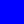
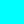

# The New and Improved _beatblock guide_
<!-- title: The New and Improved _beatblock guide_ -->
More info from base editor guide.

## Table of Contents

- [Getting Started](#getting-started)
  - [Importing Songs](#importing-songs)
  - [GETTING THE OFFSET](#getting-the-offset)
  - [Issues with Importing Songs](#issues-with-importing-songs)
  - [Placing Notes \& Events](#placing-notes--events)
  - [Note Types](#note-types)
    - [VFX Event Types](#vfx-event-types)
    - [Other Event Types (and advanced)](#other-event-types-and-advanced)
  - [Editor Hotkeys](#editor-hotkeys)
- [Var List](#var-list)
  - [Bools](#bools)
    - [Standard Bools](#standard-bools)
    - [Hidden/Editor Only Bools)](#hiddeneditor-only-broken-stuff-and-goofy-or-editor-only)
  - [Eases](#eases)
    - [VFX Easables](#vfx-easables)
    - [Player Easables](#player-easables)
    - [Hidden Easables](#hidden-easables)
- [Deco](#deco)
  - [Color Channels (and another bypass mod)](#color-channels-and-another-bypass-mod)
  - [Deco Properties](#deco-properties)
  - [Still Decos](#still-decos)
  - [Animated Decos](#animated-decos)
- [Rhythms 101](#rhythms-101)
  - [Basic Rhythms](#basic-rhythms)
  - [Weird/advanced rhythms](#weirdadvanced-rhythms)
- [Custom Levels](#custom-levels)
  - [Where to Get them](#where-to-get-them)
  - [How to import the custom levels](#how-to-import-the-custom-levels)

## Getting Started

### Importing Songs

1. Download song file in the format of OGG Vorbis(.ogg) (for YT vids use [cobalt](https://cobalt.tools))
2. Open two instances(or tabs) of file explorer.
3. Open one to where you downloaded the file to and the other instance(or tab) to the level folder
4. Move/copy the .ogg file to the level folder.
5. In the level editor place a play song event(in the gameplay section)
6. In the 'file' section, put the file name(with .ogg).
7. Make sure to put the BPM and offset.

### GETTING THE OFFSET

#### if you don't do this I will personally find and attack you (that's a joke)

1. Download [Audacity](https://www.audacityteam.org/download/windows/)
2. Open Audacity
3. Drag and drop the OGG file from file explorer to Audacity.
4. Set the time view to seconds+milliseconds in Audacity.
5. Zoom in to the start of the song and click where the wavelengths start to spike. (most songs will be under 1 second but there are some exceptions)
6. Enter the value shown in the time display into the offset section of the play song trigger.

### Issues with Importing Songs

#### Make sure that you have an OGG vorbis file

- Many converters and downloaders will give you a non OGG file just with the file extension changed.

- Downloading YT vids from [cobalt](https://cobalt.tools) is known to work
- Converting with Audacity also works
    1. Import file to Audacity by dragging and dropping
    2. Go to file>export audio
    3. Select Export to computer
    4. Change format to `Ogg Vorbis File` from `WAV (Microsoft)`
    5. Re-import the song.

#### Make sure you have file name extensions enabled

- Windows
    1. Press view on the top ribbon in file explorer.
    2. Hover over show.
    3. Turn on file name extensions.

- Linux
    1. Most Linux file managers already have this setup, and there are so many there's no point in listing instructions for all of theme here.

- MacOS
    1. Open finder
    2. In the top bar, go to Finder > Settings.
    3. From there go to advanced and turn "show all filename extensions" on.
- Make sure you actually changed BPM and added your offset.

### Placing Notes & Events

[im just gonna make a youtube tutorial]


### Note Types

| Note Name | Note Desc                                                                                                 | Image                                |
| --------- | --------------------------------------------------------------------------------------------------------- | ------------------------------------ |
| Block     | We beat these, they're the simplest note. Hit them with your paddle.                                      |    |
| Hold      | Also hit these with paddles but you must keep your paddle on it for the duration of the hold.*            |      |
| Inverse   | Negative Blocks, they come from the opposite direction. You must hit it with the backside of your paddle. |    |
| Mine      | The spikey block, If you block this with your paddle, You'll get hurt. Point your paddle away from it.    |          |
| Mine Hold | The hold varient of a mine. It's like a mine but longer and can hurt you consecutively. don't touch.      |  |
| Side      | You can not hit these straight on, Strike them on their side to destory it. (Purpz's worst enemy)         |          |
| Trace     | These are not naturally available (Advanced). It creates a dithered line between 2 points.**              |        |
| ExtraTap  | its a tap, but not constrained to a specific note. so uh go wild (please don't i can only press z so fa-) |  |

\* If you increased extraHoldLeniency (see VFX easables), Then you will be able to move your paddle without breaking the hold. 

** talk to flecha da foxy for more ~ _IPz

### VFX Event Types

| Event Name | Event Desc                                                                                                    | Image                            |
| ---------- | ------------------------------------------------------------------------------------------------------------- | -------------------------------- |
| Ease       | The world's most powerful event in the game IMO and everything in Eases can be altered with this event.       |     |
| Decoration | Everything artwise found in charts is the responsiblity of the Deco Event. For more, Go to the Deco Section.  |     |
| H.O.M.     | Hall of Mirrors, You know that effect when you are in the skybox outside the map? that? it's that.            |    |
| Noise      | It creates a Noise/Static effect, Best used with HOM to make a trailing effect with notes. Will kill bitrate  |   |
| Set Bool   | Sets a Boolean to either True or False. Essentially a weaker version of Ease.                                 |   |
| Outline    | it creates an outline around Notes, Cranky, and text.                                                         |  |
| Particles  | Toggles the particles, that is all i know. If you want to help anywhere like this, please make a pull request |  |
| Set Color  | Sets a certain palette value to a specific color of the charter's choice. Easable for smooth color transition |  |
| S. BGColor | Sets the background to a certain palette value.                                                               |  |
| ForcePSprt | Forces Player Sprite. It can be set to a custom sprite as well if you add it to level file.                   |   |

### Other Event Types (and advanced)

| Event Name | Event Desc                                                                                       | Image                              |
| ---------- | ------------------------------------------------------------------------------------------------ | ---------------------------------- |
| Play       | Plays the song audio file. Must be OGG Vorbis (.ogg) file or it won't work correctly.            |       |
| Play Sound | Plays a sound, like any sound. as long it's in the level file or in the base game...             |    |
| Bookmark   | Much like an actual bookmark, creates a pointer that you can find easily with Alt in the editor. |      |
| Set BPM    | ... sets the Beats Per Minute. Please get what it is and don't set it to an arbitrary value.     |  |

### Editor Hotkeys

| Hotkey     | Purpose                | Notes                                                                                                                                                    |
| ---------- | ---------------------- | -------------------------------------------------------------------------------------------------------------------------------------------------------- |
| P          | Play                   | Editor play is diff from playing from menu. (why some vars break)                                                                                        |
| S          | Save                   | Saves your chart.                                                                                                                                        |
| alt        | Opens alternate slider | This is what [Bookmarks](#other-event-types-and-advanced) are for. The slider will be split into section using those Bookmarks as chapters essentially.  |
| ctrl + R   | Resets windows         | Resets the editor tabs/windows to their default positions.                                                                                               |
| ctrl + C   | Copy                   | Only in multiselect.                                                                                                                                     |
| ctrl + V   | Paste                  | Only after Copy. Pastes on the beat your mouse is on and corresponding from pos1 when copied. Doesn't work between charts.                               |
| ctrl + I   | Open Properties        | The one of most important keybind here and is needed to set name and difficulty of the chart.[*](#idk-why-they-dont-say-this-when-first-opening-a-chart) |
| tab        | Type playback speed    | Only when playback speed is focused.                                                                                                                     |
| shift + M1 | MultiSelect            | Requires to be used twice to actually function.                                                                                                          |

> * ###### IDK why they don't say this when first opening a chart.
## Var List

### Bools

these are "caseSensitive"

#### Standard Bools

| Variable Name             | Default | Description                                                            |
| ------------------------- | ------- | ---------------------------------------------------------------------- |
| vfx.hwaves.flip           | false   | Should the amplitude of hwaves flip every frame? (hwaves is easable)   |
| vfx.notesFollowPlayer     | true    | Should notes move with the player when p.x or p.y is changed           |
| vfx.drawCombo             | true    | Should combo be displayed?                                             |
| vfx.drawAccuracy          | true    | Should accuracy be displayed in expanded hud?                          |
| vfx.drawSongTitle         | true    | Should song title be displayed in expanded hud?                        |
| vfx.drawUI                | true    | Should UI be displayed? (has priority over draw vars)                  |
| vfx.ignoreNoiseCorrection | false   | Should the alternate noise calculation methode be used?                |
| exitingLevel              | false   | Should the level end on pause-resume or beat 0 if placed in load beat? |
| vfx.calibration           | false   | Should the level use calibration system?                               |
| paused                    | false   | Should the level be paused?                                            |
| holdEntityDraw            | true    | Should do something with holds?                                        |

#### Hidden/Editor Only (broken stuff and goofy or editor only)

| Variable Name             | Default | Description                                                                                                       |
| ------------------------- | ------- | ----------------------------------------------------------------------------------------------------------------- |
| choosingVariant           | true    | Should do something?                                                                                              |
| errorDialogue             | false   | Should the error dialogue exist? (does make _an_ error dialogue in standard play, just not the one it's meant to) |
| levelPropertiesDialogue   | false   | Should the level properties dialogue exist?                                                                       |
| allowDevOnly              | false   | Should dev only stuff be allowed?                                                                                 |
| overlappingEventsDialogue | false   | Should the overlapping events dialogue be shown?                                                                  |
| resetwindows              | false   | Should the windows be reset?                                                                                      |
| multieditdeltamode        | false   | Should delta mode be enabled in multiselect?                                                                      |
| altSliderHovered          | false   | Should the alt slider be hovered over?                                                                            |
| altSliderHeld             | false   | Should the alt slider be held?                                                                                    |
| startClickFromSlider      | false   | Should do something?                                                                                              |
| And more variables        | yes     | Should there be more vars?                                                                                        |

`THE INCONSISTENCIES ARE`**`NOT MY FAULT`**`, blame the devs.`_`(jk they are amazing people, please don't yell at them)`_

### Eases

#### VFX Easables

| Variable Name           | Default | Description                                                                                                                   |
| ----------------------- | ------- | ----------------------------------------------------------------------------------------------------------------------------- |
| scrollSpeed             | 1       | Multiplies the scroll speed set in the level properties.                                                                      |
| extraHoldLeniency       | 0       | Adds to the leniency timer for holds. (sadly can't be negative)                                                               |
| noteRadius              | 9       | How big the hit radius for notes are. (not the same as scale)                                                                 |
| objectRotation          | 0       | Rotates all of the notes by a certain rotation.                                                                               |
| vfx.noteXScale          | 1       | Scales notes along X axis.                                                                                                    |
| vfx.noteYscale          | 1       | Scales notes along Y axis.                                                                                                    |
| vfx.noteXSkew           | 0       | Skews notes along X axis.                                                                                                     |
| vfx.noteYSkew           | 0       | Skews notes along Y axis.                                                                                                     |
| vfx.extraTapWidth       | 2       | Default line thickness for Extra Taps.                                                                                        |
| vfx.extraTapWidthPulse  | 3       | Line thickness for Extra Taps on pulses.                                                                                      |
| vfx.tapPulsePeriod      | 1       | How often taps should pulse.                                                                                                  |
| vfx.tapPulseStrength    | 1.5     | How much taps should grow by on pulses.                                                                                       |
| vfx.tapWidthPulse       | 3       | Line thickness for taps on pulses.                                                                                            |
| vfx.angleTwist.offset   | 0       | How much angles should be offset by at the specified distance.                                                                |
| vfx.angleTwist.distance | 8       | How far away angles should be offset from.                                                                                    |
| vfx.hglitch.strength    | 0       | How many pixels in either direction hglitch can shift.                                                                        |
| vfx.hglitch.resolution  | 3       | How tall in pixels hglitch "chunks" should be.                                                                                |
| vfx.hwaves.strength     | 0       | Controls the amplitude of the screen waves.                                                                                   |
| vfx.hwaves.offset       | 0       | How offset the waves should be.                                                                                               |
| vfx.hwaves.offsetDelta  | 0       | How much the offset should be changed ever frame.                                                                             |
| vfx.pixelate            | 1       | How pixelated the screen should be.                                                                                           |
| vfx.holdSegmentLimit    | 0       | How many segments every hold should have. (0 to disable)                                                                      |
| vfx.bgNoise             | 0       | Allows easing of the Noise event's "chance" variable.                                                                         |
| vfx.canvPos.x           | 300     | What X position the main game canvas should be drawn at.                                                                      |
| vfx.canvPos.y           | 180     | What Y position the main game canvas should be drawn at.                                                                      |
| vfx.canvPos.r           | 0       | How many degrees to rotate the main canvas.                                                                                   |
| vfx.canvPos.sx          | 1       | Scales the main game canvas hoizontally.                                                                                      |
| vfx.canvPos.sy          | 1       | Scales the main game canvas vertically.                                                                                       |
| vfx.canvPos.ox          | 300     | What X offset the main game canvas should be drawn at.                                                                        |
| vfx.canvPos.oy          | 180     | What Y offset the main game canvas should be drawn at.                                                                        |
| vfx.canvPos.kx          | 0       | Skews the main game canvas along the X axis.                                                                                  |
| vfx.canvPos.ky          | 0       | Skews the main game canvas along the Y axis.                                                                                  |
| vfx.comboX              | 0       | What X Position the combo counter should be drawn at.                                                                         |
| vfx.comboY              | 0       | What Y Position the combo counter should be drawn at.                                                                         |
| vfx.accuracyX           | 0       | What X position the accuracy should be drawn at.                                                                              |
| vfx.accuracyY           | 0       | What Y position the accuracy should be drawn at.                                                                              |
| vfx.songName.X          | 0       | You get it.                                                                                                                   |
| vfx.songName.Y          | 0       | You get it.                                                                                                                   |
| vfx.difficultyX         | 0       | You get it.                                                                                                                   |
| vfx.difficultyY         | 0       | You get it.                                                                                                                   |
| vfx.uiColor             | 1       | Change color channel UI uses. int(0-7)                                                                                        |
| vfx.glitchUIElements    | 0       | Glitches UI Elements: <br/> 0 - None, <br/> 1 - Combo, <br/> 2 - Combo + Acc, <br/> 3 - Combo + Acc + SongName, <br/> 4 - All |
| vfx.hueShift            | 0       | Shift the hue of the level by given amount.                                                                                   |
| vfx.flashStrength       | 0       | How much the screen flash is visible at given time.                                                                           |
| vfx.flashColor.r        | 0       | Adjusts red value of screen flash.<br/> Integers [0-255] only                                                                 |
| vfx.flashColor.g        | 0       | Adjusts green value of screen flash.<br/> Integers [0-255] only                                                               |
| vfx.flashColor.b        | 0       | Adjusts blue value of screen flash. <br/> do i even have to say it anymore?                                                   |

#### Player Easables

| Variable Name       | Default | Description                                                            |
| ------------------- | ------- | ---------------------------------------------------------------------- |
| p.x                 | 300     | Cranky's X pos.                                                        |
| p.y                 | 180     | Cranky's Y pos.                                                        |
| p.paddleDistance    | 31      | The distance between Cranky and the Paddle.                            |
| p.lookYOffset       | 0       | Changes where Cranky's eyes are drawn on the Y axis.                   |
| p.lookRadius        | 6       | The radius where Cranky's eyes will follow your cursor.                |
| p.outlineColor      | 1       | Changes Cranky's outline color channel int(0-7)                        |
| p.fillColor         | 0       | Changes Cranky's fill color channel int(0-7)                           |
| p.faceColor         | -1      | Changes Cranky's face color channel. -1 shows OG colors. (-1+int(0-7)) |
| p.bodyRadius        | 20      | The radius that Cranky's body is drawn at.                             |
| p.drawScale         | 1       | The scale that Cranky is drawn at.                                     |
| p.layer             | 0       | The layer that Cranky is drawn on.                                     |
| p.extend            | 0       | Extend Cranky's body and paddle.                                       |
| p.ouchTime          | 15      | How long the pulse from missing a note lasts.                          |
| p.lineWidth         | 2       | How thick Cranky's outlines are.                                       |
| p.bodyPulse         | 0       | The scale of Cranky's main body. Can be overrided by misses.           |
| p.maxBodyPulse      | 0.2     | How stong the pulse from missing a note is.                            |
| p.feedbackAmplitude | 2.5     | How strong the feedback is for hitting notes with the paddle.          |
| p.feedbackDuration  | 4       | How long the feedback for hitting with the paddle lasts.               |

#### Hidden Easables
| Variable Name | Default | Description                                   | Broken?              |
| ------------- | ------- | --------------------------------------------- | -------------------- |
| misses        | 0       | How many misses there are.                    | No                   |
| maxHits       | ???     | idk, smth about forceScore, whatever that is. | Maybe                |
| barelies      | 0       | How many barelies there are.                  | No                   |
| voidColor     | 0       | Change the void color.                        | No                   |
| offset        | 0       | Controls song offset.                         | Maybe                |
| cBeat         | 0       | Set's beat(relative)                          | Kinda(breaks editor) |
<sub/> There are text eases, more info **will** be in wiki

## Deco

### Color Channels (and another bypass mod)

| ColorChannel | DecoColor |                                |
| ------------ | :-------: | ------------------------------ |
| 0            |  #FFFFFF  |    |
| 1            |  #000000  |    |
| 2            |  #FF0000  |      |
| 3            |  #0000FF  |    |
| 4            |  #00FF00  |    |
| 5            |  #FFFF00  |   |
| 6            |  #FF00FF  |  |
| 7            |  #00FFFF  |     |

If you wish to bypass this color limit, I would recommend using the ["Colorful!"](https://github.com/ImPurplez/Colorful/releases/tag/v1) mod.

### Deco Properties

| Property Name     | Use                                                                                                                                                                                       |
| ----------------- | ----------------------------------------------------------------------------------------------------------------------------------------------------------------------------------------- |
| order             | Sets order of priority for the <ins>deco event itself.</ins> <br/> Helpful for events running on the same beat that alter different properties & easings for the same deco.               |
| id                | Allows you to assign and call IDs associated with a deco, making it easier o modify specific deco events without re-adding input for the *sprite* property.                               |
| sprite            | Controls what image/animation file the deco uses (via filename entry) (if left blank, you get the bubbletabby cat.) [For sprite properties, go to the lower section.](#sprite-properties) |
| parentid          | Unique ID for the parent deco (@player parents to cranky) (if ID is nonexistent, deco will have no parent)                                                                                |
| rotationinfluence | How much the parent rotation influences the child deco. Please remember to set the value if you are are parenting to Cranky                                                               |
| orbit             | When turned on, it will only rotate position, the angle will be unchanged.                                                                                                                |
| x/y               | X & Y positions relative to the screen, 0/0 is left/top, 300/180 is right/bottom.                                                                                                         |
| r                 | (Base) rotation Angle                                                                                                                                                                     |
| sx/sy             | Scale along the X/Y plane 1/1 is standard, 1.5/1.5 is scaled out, 1.5/1 is stretched out along X.                                                                                         |
| ox/oy             | Offsets the center point of the deco that rotation, scale, and skew are based on. By default located at top-left pixel.                                                                   |
| drawLayer         | Assigns decos to render on fg, bg, or onTop. (onTop is nonfunctional, if it was it would be unnafected by VFX)                                                                            |
| drawOrder         | Further sorts deco within same layer                                                                                                                                                      |
| recolor           | Display the deco as a single solid color.                                                                                                                                                 |
| outline           | Toggles whether the outline VFX event applies to this deco.                                                                                                                               |
| hide              | Toggles whether deco is hidden.                                                                                                                                                           |
| duration          | <ins>Not applicable for deco creation events.</ins> Sets the duration for given transformations to apply.                                                                                 |
| ease              | <ins>Not applicable for deco creation events.</ins> Sets the easing for the given values with the given duration.                                                                         |

### Still Decos

All images you want to use must operate within the [8 color channel limit](#color-channels-and-another-bypass-mod). <ins>*Every pixel in your image must match one of the [eight colors specified above](#color-channels-and-another-bypass-mod)*</ins>. If it is even a single RGB value off of one of these channel, things will get messed up. You can bypass this with the [*Colorful*](https://github.com/ImPurplez/Colorful/releases/tag/v1) mod.

### Animated Decos

Animated Deco is a spritesheet of an animation that must comply to the [8 color channel limit](#color-channels-and-another-bypass-mod) much like the normal still decos.
An example of a spritesheet looks like such.

|  |
| - |

The spritesheet requires a JSON file with the same name as the spritesheet file for the game to actually interpet the spritesheet correctly.
Spritesheet is also indexed start from 0. i.e. if your animation has 16 frames, it will be indexed from 0-15.

#### Json Properties
| properties | description                                                                                 | optional? |
| ---------- | ------------------------------------------------------------------------------------------- | --------- |
| width      | The width of one of the sprite's frames.                                                    | No.       |
| height     | The height of one of the sprite's frames.                                                   | No.       |
| fps        | The frames per second of the animation. By default it's 60fps                               | No.       |
| frames     | The amount of frames of the animation, needed if the animation has empty frames at the end. | Yes.      |
| loop       | Loops the animation - Boolean                                                               | Yes.      |
| states     | The states of the animation, i.e. if you want a reversed verison of the animation.          | Yes.      |

An example of a JSON file will be used with the previous example image.

```
{
    "width": 600,
    "height": 300,
    "fps": 5,
    "frames": 5,
    "loop": true
    "states": [
      {
        "name": "Reverse",
        "frames": [
          4,
          3,
          2,
          1,
          0
        ]
      }
    ]
}
```

#### Sprite Properties
Animated Deco gets called in the Deco event in certain ways.
| Sprite Property          | Description                                                               |
| ------------------------ | ------------------------------------------------------------------------- |
| [SPRITE]                 | loads the sprite according to the json file, won't load if there is none. |
| [SPRITE].png             | Just loads the spritesheet as is, Not the animation.                      |
| [SPRITE]!state           | Loads a state of the animation                                            |
| [SPRITE]#frame           | Loads the frame specific frame number                                     |
| [SPRITE]@fps             | Loads the animation at a new fps that overrides the one in the json file. |
| [SPRITE]!state@fps       | Does what @fps does but in a specific state.                              |
| [SPRITE]!state#frame     | Does what #frame does but in a specific state.                            |
| [SPRITE]!state#frame@fps | I don't think i have to explain what this does.                           |

Side note: Only use .png for stationary deco.

## Rhythms 101

> im letting astro do this shenangains. - ~~puurz~~ purpz

### Basic Rhythms

### Weird/advanced rhythms

## Custom Levels

### Where to Get them
You can get custom levels from The [*Beatblock Browser*](https://beatblockbrowser.me/) and get WIP levels and others straight from the [_Cranky's Customs Discord Server_](https://discord.gg/sSC6RcXXm2). 

### How to import the custom levels 
The simple part, to import your Custom Levels you can either drag them into your beatblock window when in the custom levels screen or inserting the level folder manually in your file explorer.
You can find the file directory under by opening in Beatblock or by navigation to any of these directories below.

| OS      | Directory                                                                        |
| ------- | -------------------------------------------------------------------------------- |
| Windows | `%appdata%/Beatblock/Custom Levels` or `C:\Users\USER\AppData\Roaming\beatblock` |
| MacOS   | `~/Library/Application Support/Beatblock/Custom Levels`                          |
| Linux   | <ASTRO DO THIS I DON'T REMEMBER> <astro: It changes, I can't give one answer>    |

### How to export a custom level

The process is quite similar to importing.
Go to your `Custom Levels` folder and identify the Level you are going to be exporting.
Compress it into either a `.zip` (preferred) or a `.7z` file.
Once done, you can upload it on the [*Beatblock Browser*](https://beatblockbrowser.me/) if the file is less than 2mb or on the [Discord Server](https://discord.gg/sSC6RcXXm2) if bigger.
